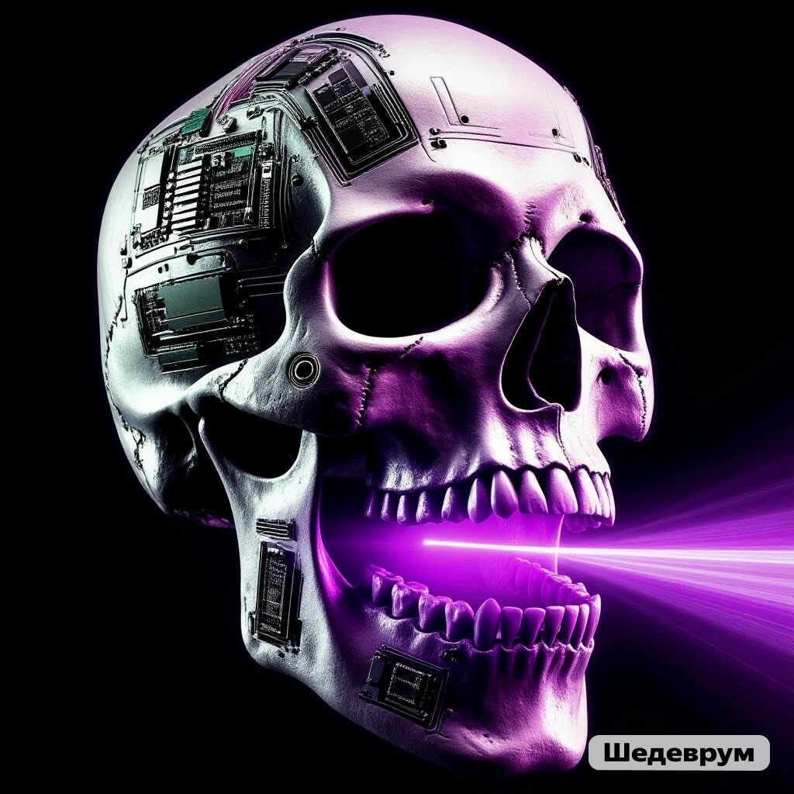

## Marauder-X: Dual-Band Edition (C5 Support)

This project is a fork of the original ESP32Marauder, ported to Arduino Core v3 and expanded to support the latest ESP32-C5 chips. The main feature of this fork is full support for 5 GHz Deauth and Wi-Fi 6, implemented using the official Espressif DevKits.

Main improvements:

Dual-Band Support (2.4/5 GHz): First implemented on the ESP32-C5.
Attacks and monitoring are now available in both bands.
Arduino Core v3: All code has been adapted to the latest SDK version, ensuring stable operation with new chips.
ESP32-C5 Ready: Supports Wi-Fi 6 (802.11ax) and modern security protocols.
DevKit Optimized: Predefined pin configurations for popular development boards.

## Supported hardware

    ESP32-C5	2.4 GHz	Wi-Fi 6	           ✅
                5 GHz	Wi-Fi 6            ✅
                2.4 GHz BlueTooth LE 5.3   ✅

    ESP32-C6	2.4 GHz	Wi-Fi 6	           ✅
                2.4 GHz BlueTooth LE 5.3   ✅
                2.4 GHz ZigBee
